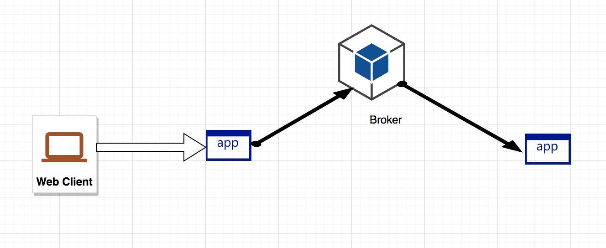

## Introduction
For developers in the age of micro services, we often need to test our containers locally. But, even on the same host, if you use `docker run` on individual containers, they won't be able to communicate with each other without proper networking setup.  

Just with Docker community version, there are `bridge, host, overlay, macvlan` , etc. It is cumbersome to manage these networks . And sometimes they even require code or configuration changes. 

The question we need to ask is : Why? Why should we care about the different docker networking model? Or docker networking plugins? All we want is app to talk to another.

In this demo, you can try out one use case of RSocket Broker, which simplifies Docker networking model.
## Demo setup
The demo has 3 parts: An RSocket broker, an RSocket server that answers the query and an RSocket client with is a web server that listens to http requests and dispatches the request to the server.   

All three parts are in Docker images.   
Next, let's see how to deploy them.   

## Simple steps

This is the simple version where most demos will be wrapped up with: Docker compose.   
"By default Compose sets up a single network for your app. Each container for a service joins the default network and is both reachable by other containers on that network, and discoverable by them at a hostname identical to the container name."   

* `git clone https://github.com/szihai/broker-flat.git`
* `cd broker-flat`
* `docker-compose up`   
After a while, all three containers will be up.        
Now let's test the result:   
* `curl http://localhost:8181/user/2`   
Not suprisingly, you can see the result in the form of json code : 
`{"id":2,"nick":"Otha Kovacek"}`   
* Stop the containers:     
`docker-compose down`

Next, let's examine the true capacity of the RSocket Broker.
## Deploy regardless of the networking
We have deployed a sample broker in public cloud, with ip:port `47.254.15.246:9999`. When we start the other two containers, we'll pass this as environmental variables. And then it doesn't matter where you run your RSocket server and client. They will be able to talk to each other.

* `docker run -e RSOCKET_BROKERS=tcp://47.254.15.246:9999 rsocket/rsocket-server`
* `docker run -e RSOCKET_BROKERS=tcp://47.254.15.23:9999 -p 8181:8181 rsocket/rsocket-client`
The port 8181 is open for web traffic, not for RSocket.
Now let's test the result:  
* `curl http://localhost:8181/user/2`   
Again, the result should be the same.

## Under the hood
RSocket is an application protocol implementing [Reactive Streams](https://en.wikipedia.org/wiki/Reactive_Streams).    
The RSocket Broker, by its name, has two features: It is a broker just like other brokers and it is implenting reactive streams.  

The broker is just like a router. It dispatches traffic. So why not other brokers? Like, for example, Kafka.   
It turns that other brokers are not easy to set up. Your client is joining a cluster. And there are steps needed to manage that. In the end you are better off using Docker networks.    
Whereis the RSocket broker is pretty simple to connect to. The connection is just like connecting to any server. And all this thanks to the great design of RSocket protocol and its communication models. To learn more, please check out [RSocket](rsocket.io/).

Now let's try to deploy your own broker.   

## Deploy your own broken
We are not going to get into the details of the deployment. You can try it on a VM, or run it in another Docker engine or deploy it in Kubernetes cluster. All we need in the end is an accesible ip and port. 

Repeat the steps in the previous section, replacing the the commands using your own `ip:port`. And it should yield the same results.

## Conclulsion
Networking is complicated. But by no means it should affect how programmers write or test the applications. By using an RSocket Broker, we can bypass the complexicity as long as there is basic connectivity.

## License
Please refer to the [License](LICENSE) file.
